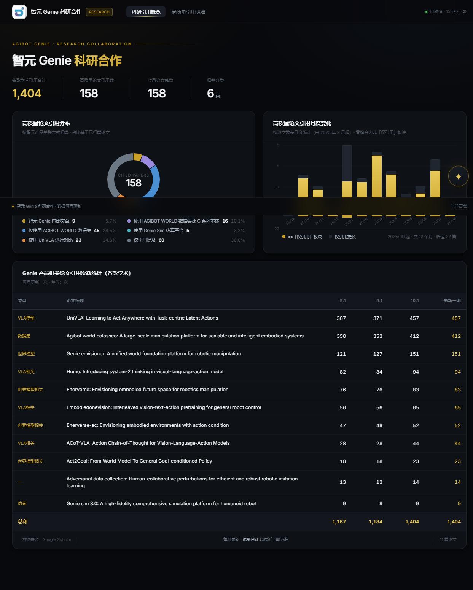
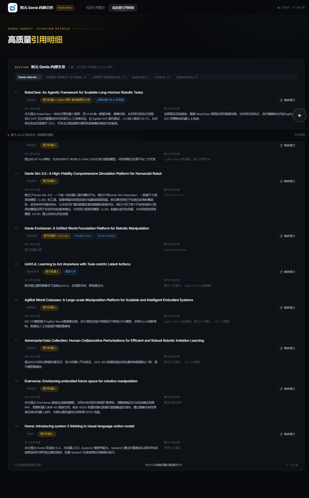

  

  # 智元精灵科研合作

  **具身智能论文引用追踪平台**

  ### [点击进入在线平台](https://genie-research.app.workbuddy.host/)

  打开即用 · 无需登录 · 桌面端体验最佳

---

## 这是什么

一页式追踪智元精灵（Genie）相关具身智能论文的引用动态。以智元产品关联方式把 **158 篇论文**归为六大板块，一屏看清引用分布、月度增长与谷歌学术引用明细，并提供悬浮论文解析 Agent 自动解析、自动建档。

## 核心功能

| 视图 | 内容 |
| --- | --- |
| **科研引用概览** | 高质量论文引用分布环形图（158 篇 · 6 类归并，中心显示收录总数）；引用月度变化柱状图（自 2025 年 9 月起，按发表月份统计）；谷歌学术引用次数统计表（11 篇论文三期读数 + 总计行） |
| **高质量引用明细** | 六大板块一键切换，逐篇查看论文标题、团队（多团队并列）、发表日期、跳转原文、核心内容与智元产品关联；「仅引用提及」板块精简为名称 + 链接 |
| **论文解析 Agent** | 右下角悬浮入口，粘贴 arXiv 链接 / DOI / 论文标题即可自动提取标题、团队、核心内容与智元产品关联，解析结果自动入库 |
| **数据后台** | 页面底部入口，支持论文与引用数据的新增、编辑、删除 |

## 数据口径

- **规模**：收录论文 158 篇 · 引用追踪 11 篇 · 谷歌学术引用合计 **1,404**（2026-10-01 期）
- **分板**：Genie Internal 9 · AGIBOT WORLD + G-Series 16 · AGIBOT WORLD Only 45 · Genie Sim 5 · UniVLA 23 · 仅引用提及 60
- **更新节奏**：谷歌学术引用每月核对一次；论文元数据取自 OpenAlex、DataCite、Crossref 公开学术数据源

## 在线入口

> **https://genie-research.app.workbuddy.host/**

直接点击上方链接或本页顶部的按钮即可打开，无需注册或安装。

---

本仓库仅作为项目对外入口页。
